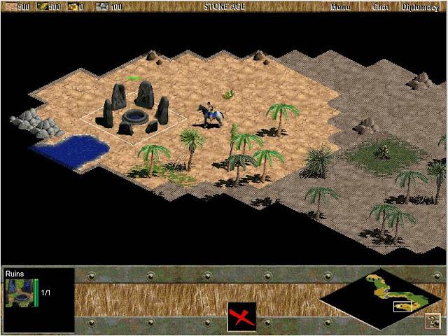

# scout

`scout` is a framework for auditing design system usage.

we are slowly building out the core engine, templates, and docs based on a rough local proof-of-concept that powered this [iOS Typography Audit](https://nyt-ios-newsreader-typography-audit.vercel.app/).

you will (eventually) be able to use this to...
- learn how UI's are using design systems
- find specific kinds of design/tech debt
- uncover any other implementation patterns
